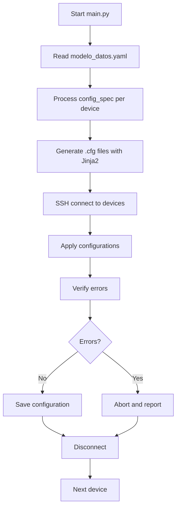

# Network Automation System with Netmiko and Jinja2

## Network Automation Engineer - UTNFRC

## General Description

This project implements an advanced network automation solution that enables fully automated configuration of multiple Cisco devices. It uses Python with Netmiko libraries for SSH connectivity and Jinja2 for configuration generation via templates. The modular architecture allows for scalability and easy maintenance.

## Project Metadata

- **Project**: Use Case Simulation
- **Version**: 1.0
- **Author**: Ed Scrimaglia
- **Creation Date**: June 15, 2025

## System Architecture

### Main Components

1. **Main Script (`main.py`)**: Coordinates the entire automation workflow
2. **ConfigDevices Class (`class_device_config.py`)**: Manages device connections and configurations
3. **CreateConfig Class (`class_create_configs.py`)**: Manages configuration file and template creation
4. **Data Model (`modelo_datos.yaml`)**: Defines infrastructure and configurations
5. **Jinja2 Templates (`templates/`)**: Templates for different configuration types

### Workflow



## Detailed Project Structure

```tree
.
├── main.py                      # Main orchestration script
├── class_device_config.py       # Class for network device management
├── class_create_configs.py      # Class for configuration creation
├── modelo_datos.yaml           # Infrastructure data model
├── pyproject.toml              # Project configuration and dependencies
├── README.md                   # This documentation
├── configs/                    # Generated configuration files
│   ├── SW_Bld_A_vlan.cfg      # VLAN configuration for SW_Bld_A
│   ├── SW_Bld_A_int_access.cfg # Access interfaces for SW_Bld_A
│   ├── SW_Bld_A_int_trunk.cfg  # Trunk interfaces for SW_Bld_A
│   ├── SW_Bld_B_vlan.cfg      # VLAN configuration for SW_Bld_B
│   ├── SW_Bld_B_int_access.cfg # Access interfaces for SW_Bld_B
│   └── SW_Bld_B_int_trunk.cfg  # Trunk interfaces for SW_Bld_B
└── templates/                  # Jinja2 templates
    ├── vlans.j2               # Template for VLAN configuration
    ├── int_access.j2          # Template for access interfaces
    └── int_trunk.j2           # Template for trunk interfaces
```

## Detailed Component Analysis

### 1. Main Script (`main.py`)

**Functionalities:**

- **Complete orchestration**: Coordinates all process phases
- **Time measurement**: Calculates duration per device and total configuration time
- **Detailed logging**: Provides feedback throughout the entire process
- **Error handling**: Implements fail-fast for each device

**Execution flow:**

1. **Initialization**:

   ```python
   net_conf = ConfigDevices()      # For network connections
   create_config = CreateConfig()  # For configuration generation
   ```

2. **Model reading**:

   ```python
   dic_modelo = create_config.read_yaml("modelo_datos.yaml")
   ```

3. **Dynamic configuration generation**:

   ```python
   for config in device.get("config_spec"):
       config_template = config.get("template")
       data_path = config.get("data_path")
       # Dynamic data resolution
       template = create_config.render_template(
           template_name=config_template, 
           data={data_path: device.get(data_path)}
       )
   ```

4. **Configuration application**:
   - SSH connection per device
   - Sequential application of configuration files
   - Error verification after each application
   - Configuration save if no errors

### 2. ConfigDevices Class (`class_device_config.py`)

**Responsibilities:**

- SSH connection management with network devices
- Sending configuration commands
- Error verification in command outputs
- Configuration saving

**Key methods:**

```python
def connect_device(self, device_params: dict) -> ConnectHandler:
    # Establishes SSH connection using model parameters
    
def send_config_commands(self, connection, config_file=None):
    # Sends configuration from file to device
    
def check_output_error(self, output: str) -> bool:
    # Searches for error indicators in command output
    error_indicators = ["% Invalid input", "% Incomplete command", "% Ambiguous command"]
    
def save_configuration(self, connection: ConnectHandler):
    # Executes 'copy running-config startup-config'
```

**Exception Handling:**

- `NetmikoTimeoutException`: Connection timeout
- `NetmikoAuthenticationException`: Authentication failure
- Generic read/write errors

### 3. CreateConfig Class (`class_create_configs.py`)

**Responsibilities:**

- Jinja2 template rendering
- Configuration file creation and writing
- YAML file reading
- JSON serialization

**Main methods:**

```python
def render_template(self, template_name: str, data: any, template_dir: str = "./templates"):
    # Loads and renders Jinja2 template with specific data
    loader = FileSystemLoader(template_dir)
    env = Environment(loader=loader)
    template = env.get_template(template_name)
    return template.render(data)

def guardar_config_file(self, filename: str, configuration: str):
    # Writes rendered configuration to file
    
def read_yaml(self, file_path: str) -> dict:
    # Reads and parses YAML file from data model
```

### 4. Data Model (`modelo_datos.yaml`)

**Hierarchical structure:**

```yaml
modelo:
  metadatos:
    proyecto: "Simulacro de Caso de Uso"
    version: "1.0"
    autor: "Ed Scrimaglia"
    fecha_creacion: "2025-06-15"
  
  infra_spec:
    devices:
      - hostname: "SW_Bld_A"
        management:
          ip: "X.X.X.X"
          interface: "GigabitEthernet0/0"
        connection:
          device_type: "cisco_ios"
          host: "X.X.X.X"
          username: "xxxx"
          password: "xxxx"
          global_delay_factor: 1
          ssh_config_file: "~/.ssh/config"
        interfaces:
          - name: "GigabitEthernet0/1"
            description: "Conexion a SW_CORE_1"
            mode: trunk
            trunk_mode: auto
            allowed_vlans: "10,20,30"
        vlans:
          - id: 10
            name: "Ingenieria"
          - id: 20
            name: "Produccion"
        config_spec:
          - data_path: "vlans"
            template: "vlans.j2"
            config_file: "vlan.cfg"
          - data_path: "interfaces"
            template: "int_trunk.j2"
            config_file: "int_trunk.cfg"
```

**Innovation: config_spec:**

The `config_spec` section allows for dynamic definition of which configurations to generate:

- `data_path`: Reference to device data (`vlans`, `interfaces`)
- `template`: Jinja2 template to use
- `config_file`: Output file name

### 5. Jinja2 Templates

#### VLAN Template (`vlans.j2`)

```jinja
{# VLANs configuration template #}
!

vlan {{ vlan.id }}
  name {{ vlan.name }}
!

```

#### Access Interface Template (`int_access.j2`)

```jinja
{# Interface Access Configuration Template #}
!


interface {{ interface.name }}
  description {{ interface.description }}
  switchport mode {{ interface.mode }}
  switchport access vlan {{ interface.vlan }}
!


```

#### Trunk Interface Template (`int_trunk.j2`)

```jinja
{# Interface Trunk Configuration Template #}
!


interface {{ interface.name }} 
  description {{ interface.description }}
  switchport {{ interface.mode }} encapsulation dot1q
  switchport mode dynamic {{ interface.trunk_mode }}
  switchport trunk allowed vlan {{ interface.allowed_vlans }}
!


```

## Configured Network Topology

The system configures a network with:

### Devices

1. **SW_Bld_A** (10.2.0.10X)
2. **SW_Bld_B** (10.2.0.10X)

### VLANs (on both switches)

- **VLAN 10**: Ingenieria
- **VLAN 20**: Produccion  
- **VLAN 30**: Finanzas

### Interfaces per device

- **2 trunk interfaces**: Connections to core switches (GigabitEthernet0/1-2)
- **2 access interfaces**: Connections to PCs (GigabitEthernet1/1-2)

## Dependencies and Requirements

### Python Dependencies (pyproject.toml)

```toml
requires-python = ">=3.12"
dependencies = [
    "jinja2>=3.1.6",    # Template engine
    "netmiko>=4.6.0",   # SSH connections to network devices
]
```

### Infrastructure requirements

- Cisco devices with SSH enabled
- IP connectivity to management devices
- Valid access credentials

### 1. Clone the Repository

```bash
git clone <repository-url>
cd sim_caso
```

### 2. Configure Python Environment

Using `uv` (recommended):

```bash
uv sync
```

### 2. Model configuration

- Edit `modelo_datos.yaml` with your infrastructure data
- Adjust IPs, credentials, and device configurations
- Modify templates according to specific needs

### 3. Execution

```bash
python main.py
```

## Advanced Features

### 1. **Dynamic Configuration Based on Specifications**

- System uses `config_spec` to determine which configurations to generate
- Allows adding new configuration types without modifying code
- Dynamic data resolution using `data_path`

### 2. **Separation of Responsibilities**

- **ConfigDevices**: Network and device logic
- **CreateConfig**: Configuration generation and file handling
- **main.py**: Orchestration and flow control

### 3. **Robust Error Handling**

- Error verification after each command
- Fail-fast system that aborts on critical errors
- Detailed logging for debugging

### 4. **Performance Measurement**

- Per-device and total timing
- Real-time progress feedback
- Detailed information for each operation

### 5. **Scalability**

- Easy to add new devices to YAML model
- Reusable templates for different configurations
- Modular structure for future extensions

## Practical Use Cases

### 1. **Initial Network Deployment**

```bash
# Configure multiple switches from scratch
python main.py
```

### 2. **Mass Configuration Update**

- Modify `modelo_datos.yaml`
- Re-execute to apply changes

### 3. **Configuration Standardization**

- Guarantee consistent configurations
- Reduce manual configuration errors

### 4. **Auditing and Documentation**

- Generated files serve as documentation
- History of applied configurations

## Monitoring and Logging

The system provides detailed feedback:

```text
-> Starting Network Automation Configuration Device process...
-> Generating configuration files...
Creating configuration file 'SW_Bld_A_vlan.cfg' using template 'vlans.j2' for device 'SW_Bld_A'
Configuration files for SW_Bld_A created.

-> Configuration files available:
SW_Bld_A_int_access.cfg
SW_Bld_A_int_trunk.cfg
SW_Bld_A_vlan.cfg

-> Connecting to devices and applying configurations...
Connected to device 'SW_Bld_A' at IP '10.2.0.103'
Applying configuration from 'SW_Bld_A_vlan.cfg' for device 'SW_Bld_A'
Configuration from 'SW_Bld_A_vlan.cfg' applied successfully to device 'SW_Bld_A'
-> Configuration saved successfully on device 'SW_Bld_A' at IP '10.2.0.103'
-> Time taken to configure device 'SW_Bld_A': 0:00:15.234567
-> Total time taken to configure all devices: 0:00:32.456789
```

## Generated Files Example

### VLANs File (`SW_Bld_A_vlan.cfg`)

```conf
!
vlan 10
  name Ingenieria
!
vlan 20
  name Produccion
!
vlan 30
  name Finanzas
!
```

### Trunk Interfaces File (`SW_Bld_A_int_trunk.cfg`)

```conf
!
interface GigabitEthernet0/1
  description Conexion a SW_CORE_1
  switchport trunk encapsulation dot1q
  switchport mode dynamic auto
  switchport trunk allowed vlan 10,20,30
!
interface GigabitEthernet0/2
  description Conexion a SW_CORE_2
  switchport trunk encapsulation dot1q
  switchport mode dynamic auto
  switchport trunk allowed vlan 10,20,30
!
```

## Detailed Data Flow

### 1. **Model Reading**

```python
# The system reads modelo_datos.yaml and converts it to Python dictionary
dic_modelo = create_config.read_yaml("modelo_datos.yaml")
```

### 2. **Per-Device Processing**

```python
for device in dic_modelo.get("modelo").get("infra_spec").get("devices"):
    hostname = device.get('hostname')
    # For each device config_spec...
    for config in device.get("config_spec"):
        # Dynamically resolves data
        data_path = config.get("data_path")
        data = device.get(data_path)  # E.g.: device['vlans']
```

### 3. **Configuration Generation**

```python
# Renders template with specific data
template = create_config.render_template(
    template_name=config_template,
    data={data_path: device.get(data_path)}
)
```

### 4. **Device Application**

```python
# SSH connects and applies configuration
connection = net_conf.connect_device(connection_params)
output = net_conf.send_config_commands(connection, config_file=config_file)
```

## Extensions and Future Improvements

### 1. **Advanced Functionalities**

- Automatic backup before changes
- Rollback on failures
- Pre-application configuration validation
- Support for more device types (Juniper, Arista, etc.)

### 2. **Usability Improvements**

- Web interface for configuration management
- REST API for integration with other systems
- Real-time monitoring dashboard
- Email/Slack notifications

### 3. **Enterprise Features**

- Integration with change management systems
- Advanced logging with different levels
- Metrics and telemetry
- Support for encrypted configurations

### 4. **Optimizations**

- Parallel device configuration
- Rendered template caching
- Configuration file compression
- SSH connection optimization

## Common Troubleshooting

### 1. **SSH Connection Error**

```text
NetmikoTimeoutException: TCP connection to device failed
```

**Solution**: Verify IP connectivity and that SSH is enabled on the device.

### 2. **Authentication Error**

```text
NetmikoAuthenticationException: Authentication failed
```

**Solution**: Verify credentials in the YAML model's `connection` section.

### 3. **Command Error**

```text
% Invalid input detected at '^' marker
```

**Solution**: Review syntax in Jinja2 templates.

### 4. **Template File Not Found**

```text
TemplateNotFound: vlans.j2
```

**Solution**: Verify that the file exists in the `templates/` directory.

## Conclusions

This system represents a professional and scalable network automation implementation that:

- **Simplifies** network configuration management
- **Standardizes** deployment processes
- **Reduces** human errors in configurations
- **Accelerates** infrastructure deployment time
- **Automatically documents** applied configurations
- **Facilitates** maintenance and future updates

The modular architecture and use of industry standards (YAML, Jinja2, Netmiko) makes this project an excellent foundation for network automation implementations in production environments.

### Key Benefits

1. **Complete Automation**: From generation to application
2. **Flexibility**: Declarative configuration-based system
3. **Scalability**: Easy to add devices and configurations
4. **Maintainability**: Modular and well-structured code
5. **Observability**: Detailed logging and performance measurement
6. **Reliability**: Robust error handling and validations

---

## License

Educational project - UTN-FRC Cisco Academy - Network Automation Engineer Course

---

**Last updated**: December 2025
